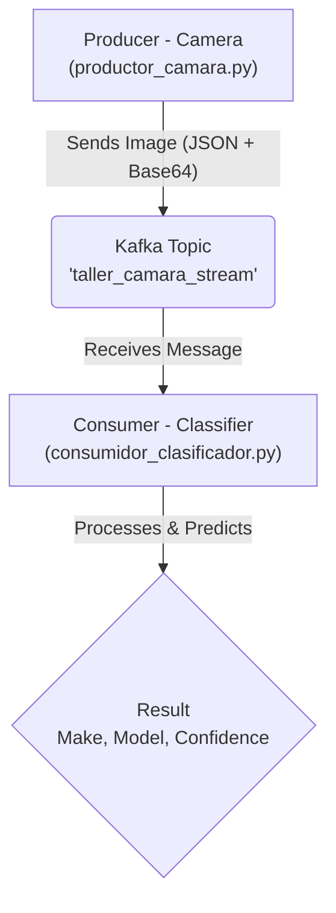

# 🚗 Real-time Car Classifier System with AI and Kafka

<div align="center">

[](https://www.python.org/)
[](https://www.tensorflow.org/)
[](https://huggingface.co/Euge57/car-classifier)
[](https://kafka.apache.org/)
[](https://www.docker.com/)

</div>

---

## 📖 Table of Contents

- [📝 About The Project](#-about-the-project)
- [✨ Key Features](#-key-features)
- [🏛️ System Architecture](#️-system-architecture)
- [🤖 Model](#-model)
- [🛠️ Tech Stack](#️-tech-stack)
- [🚀 Installation and Setup](#-installation-and-setup)
- [🕹️ Usage](#️-usage)
- [📊 Dataset](#-dataset)
- [🔮 Future Improvements](#-future-improvements)
- [✍️ About the Author](#️-about-the-author)
- [📄 License](#-license)

---

## 📝 About The Project

This project implements a complete end-to-end system for classifying car models from images, simulating a real-time data pipeline. The solution is designed to emulate a production scenario where a camera captures vehicle images, and an artificial intelligence service processes them for identification.

The architecture is decoupled into microservices that communicate via a message bus (Apache Kafka), allowing the system to be scalable, robust, and easy to maintain.

---

## ✨ Key Features

* **High-Accuracy Image Classification:** Utilizes a pre-trained `ResNet50` model, fine-tuned for detailed classification of vehicle models.
* **Real-time Data Pipeline:** Simulates a continuous data stream from a camera using **Apache Kafka**, an industry-standard technology for event streaming.
* **Decoupled Architecture:** The system is divided into a **Producer** (the simulated camera) and a **Consumer** (the classification service), allowing them to operate and scale independently.
* **Containerized Infrastructure:** The entire messaging backend (Kafka and its dependency, ZooKeeper) is cleanly and reproducibly managed via **Docker** and **Docker Compose**.

---

## 🏛️ System Architecture

The system's workflow is designed to be simple and efficient. The producer captures an image, serializes it, and sends it to a Kafka topic. The consumer, which is subscribed to that topic, picks it up for analysis and classification.



---

## 🤖 Model

The classification model used in this project has been trained and fine-tuned on the CompCars dataset. The model artifacts are versioned and publicly available on the Hugging Face Hub.

* **Hugging Face Repository:** [**Euge57/car-classifier**](https://huggingface.co/Euge57/car-classifier)

You can download the `.keras` file and the associated class mappings directly from the repository to use within this system.

---

## 🛠️ Tech Stack

The key technologies and libraries used in this project are listed below:

* **AI Modeling:** `TensorFlow 2.x` / `Keras 3`
* **Data Streaming:** `Apache Kafka`
* **Infrastructure & Containerization:** `Docker` / `Docker Compose`
* **Language & Core Libraries:** `Python 3.10+`, `kafka-python`, `Pillow`, `numpy`

---

## 🚀 Installation and Setup

Follow these steps to get the complete system running on your local environment.

*(Instructions for running the services as Docker containers are detailed in the "Usage" section).*

### Prerequisites

* [Docker](https://www.docker.com/products/docker-desktop/) and Docker Compose must be installed.
* Python 3.10 or higher (for local development outside Docker).
* `git` to clone the repository.

### Installation Steps

1.  **Clone the repository:**
    ```bash
    git clone [https://github.com/E-sanchez03/car-classifier-system.git](https://github.com/E-sanchez03/car-classifier-system.git)
    cd car-classifier-system
    ```

2.  **Download Model Files:**
    Download the model (`.keras`) and class names (`.json`) from the [Hugging Face Hub](https://huggingface.co/Euge57/car-classifier) and place them inside a `models/` directory.

3.  **Prepare Test Data:**
    Add some test images to the `data/imagenes_test/` folder.

---

## 🕹️ Usage

The entire system, including the Python applications, can be launched with a single command using Docker Compose.

1.  **Build and Run the Services:**
    From the root directory of the project, run:
    ```bash
    docker-compose up --build
    ```
    This command will:
    * Build the Docker image for the Python services.
    * Start the Kafka and ZooKeeper containers.
    * Start the `producer` and `consumer` containers.

2.  **Observe the Output:**
    The logs from all services will be streamed to your terminal. You will see the producer sending images and the consumer receiving them and printing the predictions.

3.  **Stop the System:**
    Press `Ctrl+C` in the terminal to stop all services gracefully. To clean up, run `docker-compose down`.

---

## 📊 Dataset

The model in this project was trained using the **CompCars (Comprehensive Cars) dataset**. For more information, you can visit the [official dataset page](http://mmlab.ie.cuhk.edu.hk/datasets/comp_cars/).

---

## 🔮 Future Improvements

-   [ ] **Results Persistence:** Integrate a database (e.g., PostgreSQL) to store all predictions.
-   [ ] **Visualization Dashboard:** Create a web dashboard with **Streamlit** or **Flask** to visualize statistics.
-   [ ] **Advanced Error Handling:** Implement a more granular `try-except` block in the consumer to handle "poison pill" messages.
-   [ ] **Model Optimization:** Experiment with more modern architectures (e.g., `EfficientNetV2`, `Vision Transformers`).

---

## ✍️ About the Author

This project was developed by E. Sanchez as a comprehensive showcase of a real-world MLOps pipeline.

* **GitHub:** [@E-sanchez03](https://github.com/E-sanchez03)
* **LinkedIn:** [Eugenio Sánchez Carreño](www.linkedin.com/in/eugenio-sanchez-carreno)

---

## 📄 License

Distributed under the MIT License. See `LICENSE` for more information.