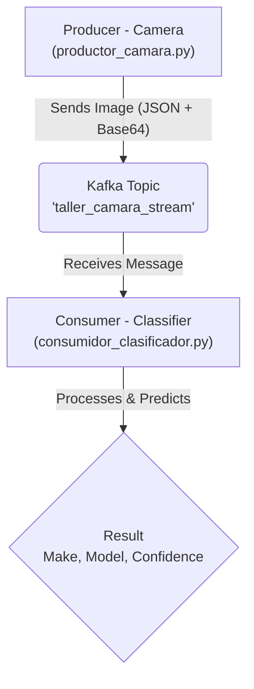

# Real-time Car Classifier System with AI and Kafka

<div align="center">

[](https://www.python.org/)
[](https://www.tensorflow.org/)
[](https://keras.io/)
[](https://kafka.apache.org/)
[](https://www.docker.com/)

</div>

---

## 📖 Table of Contents

- [📝 About The Project](#-about-the-project)
- [✨ Key Features](#-key-features)
- [🏛️ System Architecture](#️-system-architecture)
- [🛠️ Tech Stack](#️-tech-stack)
- [🚀 Installation and Setup](#-installation-and-setup)
  - [Prerequisites](#prerequisites)
  - [Installation Steps](#installation-steps)
- [🕹️ Usage](#️-usage)
- [📊 Dataset](#-dataset)
- [🔮 Future Improvements](#-future-improvements)
- [📄 License](#-license)

---

## 📝 About The Project

This project implements a complete end-to-end system for classifying car models from images, simulating a real-time data pipeline. The solution is designed to emulate a production scenario where a camera captures vehicle images, and an artificial intelligence service processes them for identification.

The architecture is decoupled into microservices that communicate via a message bus (Apache Kafka), allowing the system to be scalable, robust, and easy to maintain.

---

## ✨ Key Features

* **High-Accuracy Image Classification:** Utilizes a pre-trained `ResNet50` model, fine-tuned on the CompCars dataset for detailed classification of vehicle models.
* **Real-time Data Pipeline:** Simulates a continuous data stream from a camera using **Apache Kafka**, an industry-standard technology for event streaming.
* **Decoupled Architecture:** The system is divided into a **Producer** (the simulated camera) and a **Consumer** (the classification service), allowing them to operate and scale independently.
* **Containerized Infrastructure:** The entire messaging backend (Kafka and its dependency, ZooKeeper) is cleanly and reproducibly managed via **Docker** and **Docker Compose**.

---

## 🏛️ System Architecture

The system's workflow is designed to be simple and efficient. The producer captures an image, serializes it, and sends it to a Kafka topic. The consumer, which is subscribed to that topic, picks it up for analysis and classification.



---

## 🛠️ Tech Stack

The key technologies and libraries used in this project are listed below:

* **AI Modeling:**
    * `TensorFlow 2.x` / `Keras 3`
* **Data Streaming:**
    * `Apache Kafka`
* **Infrastructure & Containerization:**
    * `Docker` / `Docker Compose`
* **Language & Core Libraries:**
    * `Python 3.10+`
    * `kafka-python`
    * `Pillow`
    * `numpy`
    * `scipy` (for preprocessing dataset metadata)

---

## 🚀 Installation and Setup

Follow these steps to get the complete system running on your local environment.

### Prerequisites

* [Docker](https://www.docker.com/products/docker-desktop/) and Docker Compose must be installed.
* Python 3.10 or higher.
* `git` to clone the repository.

### Installation Steps

1.  **Clone the repository to your local machine:**
    ```bash
    git clone [https://github.com/E-sanchez03/car-classifier-system.git](https://github.com/E-sanchez03/car-classifier-system.git)
    cd car-classifier-system
    ```

2.  **Start the Kafka infrastructure with Docker Compose:**
    This command will pull the necessary images and start the Kafka and ZooKeeper containers in the background.
    ```bash
    docker-compose up -d
    ```

3.  **Create a virtual environment and install Python dependencies:**
    It is a best practice to isolate project dependencies.
    ```bash
    python -m venv venv
    source venv/bin/activate  # On Windows: venv\Scripts\activate
    pip install -r requirements.txt
    ```

4.  **Prepare the model and data resources:**
    * Place your trained model (e.g., `clasificador_coches_v4.keras`) and the class mapping file (e.g., `marcas_coches.json`) in the `models/` folder.
    * Add some test images to the `data/imagenes_test/` folder.

---

## 🕹️ Usage

To run the system, you will need to open **two separate terminals** in the project's root directory (with the virtual environment activated).

1.  **In Terminal 1, start the Consumer:**
    This script will load the model and wait to receive messages.
    ```bash
    python consumidor_clasificador.py
    ```
    *Expected output:*
    ```
    Loading model and class names...
    Model and classes loaded successfully!
    Consumer listening on topic 'taller_camara_stream'...
    ```

2.  **In Terminal 2, start the Producer:**
    This script will begin sending images from the test folder to the Kafka topic.
    ```bash
    python productor_camara.py
    ```
    *Expected output:*
    ```
    Producer started. Sending images every 5 seconds...
    Sent: coche_bmw.jpg from camera cam01
    Sent: coche_audi.png from camera cam01
    ...
    ```

3.  **Observe the results:**
    Return to Terminal 1. You will see the predictions printed in real-time as the consumer processes the images sent by the producer.

---

## 📊 Dataset

The model in this project was trained using the **CompCars (Comprehensive Cars) dataset**, which provides a wide variety of car images from different perspectives.

For more information, you can visit the [official dataset page](http://mmlab.ie.cuhk.edu.hk/datasets/comp_cars/).

---

## 🔮 Future Improvements

This project serves as a solid foundation that can be extended in many ways:

-   [ ] **Results Persistence:** Integrate a database (e.g., PostgreSQL, MongoDB) to store all predictions generated by the consumer.
-   [ ] **Visualization Dashboard:** Create a web dashboard with **Streamlit** or **Flask** to visualize statistics and classified cars in real-time.
-   [ ] **Containerized Microservices:** Package the producer and consumer into their own Docker containers for easier deployment and scaling.
-   [ ] **Advanced Error Handling:** Implement a more granular `try-except` block within the consumer's loop to handle "poison pill" messages without stopping the service.
-   [ ] **Model Optimization:** Experiment with more modern architectures (e.g., `EfficientNetV2`, `Vision Transformers`) to improve accuracy and inference speed.

---

## ✍️ About the Author

This project was developed by E. Sanchez as a comprehensive showcase of a real-world MLOps pipeline.

* **GitHub:** [@E-sanchez03](https://github.com/E-sanchez03)
* **LinkedIn:** [Eugenio Sánchez Carreño](www.linkedin.com/in/eugenio-sanchez-carreno)

---

## 📄 License

Distributed under the MIT License. See `LICENSE` for more information.